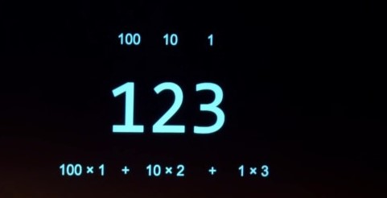

# CS50_Harvard

<h2>Acá van a ir las notas que voy a tomar del Curso cs50 de Harvard</h2>

El numero 123 se descompone de la forma decimal(base 10) a :

100 * 1 ==> primera posicion
10 * 2  ==> segunda posicion
1 * 3 ==> tercera posicion

